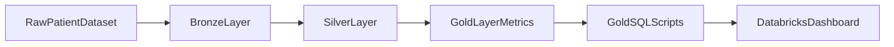

# health-cat-dashboard

Healthcare analytics project that explores diabetic patient readmission patterns and publishes dashboard-ready metrics on Databricks. The goal is to turn raw hospital encounter data into clear readmission insights that support faster clinical and operational decisions.

## Problem and Outcome

Hospital teams need a clear view of what drives diabetic patient readmissions (age, diagnosis, length of stay, admission type, and discharge patterns). This project analyzes the UCI Diabetes 130-US hospitals dataset and produces reusable SQL outputs and dashboard assets to highlight trends and risk segments.

- Dataset: [UCI Diabetes 130-US hospitals (1999-2008)](https://archive.ics.uci.edu/dataset/296/diabetes+130+us+hospitals+for+years+1999+2008)
- Outcome: decision-ready readmission metrics for dashboarding and stakeholder review

## What This Project Delivers

- A Databricks notebook workflow for exploration and transformation: `notebooks/diabetic-patient-exploration.ipynb`
- Gold-layer SQL scripts (`gold_sql_scripts/*`) for readmission rates by key dimensions:
- Databricks dashboard assets:
  - `src/diabetes_re_admission_stats_usa_10_years.lvdash.json`
  - `pdf/` (presentation export directory for dashboard PDFs)

## Agentic Development with Cursor

This repository is also a practical example of agentic analytics development in Cursor.

- The `NOTEBOOK` skill gives an agent the ability to fully autonomously write an ETL pipeline using Jupyter notebooks.

Automation journey next steps:

- Automate SQL query generation, execution, and review loops.
- Automate Databricks dashboard edits and rapid iteration of visual analytics.


## Architecture and Data Flow

The pipeline follows a medallion-style flow and a notebook pattern of explore -> process -> verify -> write -> verify.



## Repository Map

- `notebooks/`: main notebook and helper scripts for local notebook workflows
- `gold_sql_scripts/`: dashboard-facing SQL definitions for gold-layer readmission reporting
- `src/`: dashboard JSON source artifact
- `pdf/`: presentation-ready dashboard exports (add your PDF here)
- `databricks.yml`: Databricks Asset Bundle configuration
- `requirements-dev.txt`: local Python development dependencies

## Quick Start (Sanitized)

### 1) Install Databricks CLI

```bash
databricks --version
```

### 2) Authenticate with your Databricks workspace

```bash
databricks auth login --host <DATABRICKS_HOST> --profile <DATABRICKS_PROFILE>
databricks auth profiles
```

### 3) Set up local Python environment

```bash
python3 -m venv .venv
source .venv/bin/activate
pip install -r requirements-dev.txt
```

### 4) Validate and deploy Databricks assets

```bash
databricks bundle validate --profile <DATABRICKS_PROFILE>
databricks bundle deploy -t dev --profile <DATABRICKS_PROFILE>
```

## Impact and Next Steps

Current value:

- Converts raw healthcare data into repeatable readmission metrics.
- Makes high-impact dimensions easy to analyze for business and clinical stakeholders.
- Provides a foundation for operational dashboarding on Databricks.

Next improvements:

- Add stronger automated data quality checks per medallion layer.
- Add CI checks for bundle validation and SQL quality.
- Expand scenario-specific readmission cohorts and benchmark slices.

## Appendix: Technical Commands

Pull notebook from Databricks Workspace to local `.ipynb` format:

```bash
databricks workspace export "<USER_WORKSPACE_PATH>/diabetic-patient-exploration.ipynb" \
  --format JUPYTER \
  --file "notebooks/diabetic-patient-exploration.ipynb" \
  --profile <DATABRICKS_PROFILE>
```

